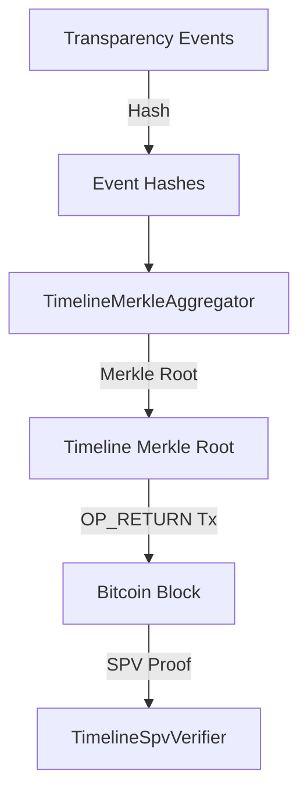

# Bitcoin Timeline Anchoring

To guarantee the historical immutability of the attestation timeline, PQ-RASCV v2 aggregates transparency events and anchors the resulting Merkle root to the Bitcoin blockchain. The verifier validates these anchors using Simplified Payment Verification (SPV).

## Architecture Overview



## Merkle Aggregation

The `TimelineMerkleAggregator` batches canonical transparency event hashes and constructs a Bitcoin-compatible Merkle tree using double-SHA256 (`SHA256d`):

```rust
pub struct TimelineMerkleAggregator {
    /// Canonical hashes of transparency events in this batch.
    event_hashes: Vec<[u8; 32]>,
}
```

For each event in the batch, the aggregator converts the 32-byte event hash into a leaf node by hashing it again: `SHA256d(event_hash)`.

## Inclusion Proofs

An inclusion proof connects a specific event hash to a confirmed Bitcoin block. This is represented by `TimelineInclusionProof`:

```rust
pub struct TimelineInclusionProof {
    /// Bitcoin block height.
    pub block_height: u32,
    /// Bitcoin block header (80 bytes).
    pub block_header: Vec<u8>,
    /// Merkle proof path from the anchor transaction to the block's Merkle root.
    pub tx_merkle_path: TxMerklePath,
    /// The full timeline Merkle root committed in the anchor OP_RETURN.
    pub timeline_merkle_root: [u8; 32],
    /// Merkle proof path from the event hash to the timeline Merkle root.
    pub event_merkle_path: MerkleProofPath,
}
```

## SPV Verification

The `TimelineSpvVerifier` verifies the proof to ensure that:
1. The block containing the anchoring transaction has reached the required number of confirmations.
2. The block header's Merkle root matches the Merkle root specified in the transaction inclusion proof.
3. The anchoring transaction is present in the block's transaction list.
4. The timeline Merkle root is committed within the anchoring transaction's OP_RETURN output.
5. The event's hash is part of the timeline Merkle root.

```rust
impl TimelineSpvVerifier {
    pub fn verify(&self, proof: &TimelineInclusionProof, event_hash: &[u8; 32]) -> Result<u32, SpvError> {
        // 1. Confirm block depth (confirmations >= min_confirmations)
        // 2. Verify block header's Merkle root matches the tx merkle path root
        // 3. Verify transaction inclusion path in block header
        // 4. Verify timeline root matches event merkle path root
        // 5. Verify event hash inclusion path in timeline Merkle root
        // ...
    }
}
```
