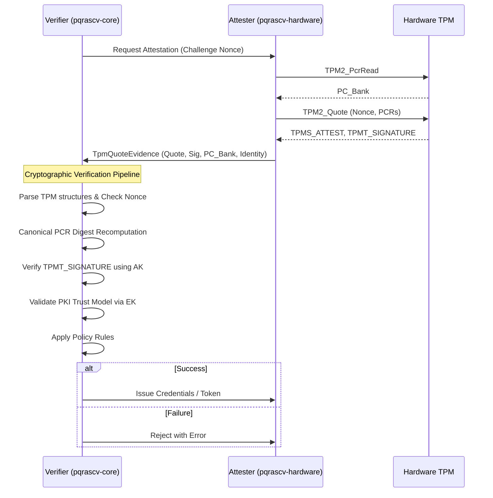

# TPM Attestation Flow

This sequence models the complete lifecycle of a single remote attestation relying on TPM 2.0.

```mermaid
sequenceDiagram
    participant Verifier as Verifier (pqrascv-core)
    participant Device as Attester (pqrascv-hardware)
    participant TPM as Hardware TPM
    
    Verifier->>Device: Request Attestation (Challenge Nonce)
    Device->>TPM: TPM2_PcrRead
    TPM-->>Device: PC_Bank
    Device->>TPM: TPM2_Quote (Nonce, PCRs)
    TPM-->>Device: TPMS_ATTEST, TPMT_SIGNATURE
    Device->>Verifier: TpmQuoteEvidence (Quote, Sig, PC_Bank, Identity)
    
    Note over Verifier: Cryptographic Verification Pipeline
    Verifier->>Verifier: Parse TPM structures & Check Nonce
    Verifier->>Verifier: Canonical PCR Digest Recomputation
    Verifier->>Verifier: Verify TPMT_SIGNATURE using AK
    Verifier->>Verifier: Validate PKI Trust Model via EK
    Verifier->>Verifier: Apply Policy Rules
    
    alt Success
        Verifier->>Device: Issue Credentials / Token
    else Failure
        Verifier->>Device: Reject with Error
    end
```
