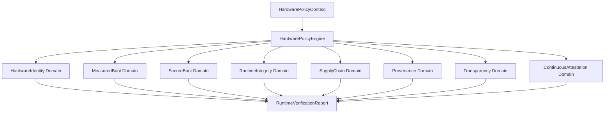

# Trust Domains Framework

To prevent semantic leakage and ensure auditability, the PQ-RASCV v2 verifier evaluates the trustworthiness of a platform using eight independent trust domains. The verifier does not collapse the verification results into a single trusted boolean before auditing/reporting, which allows administrators to pinpoint the exact failure reason and apply fine-grained policy rules.

## The Eight Trust Domains

| Trust Domain | Purpose | Key Verification Mechanisms | Reference Module |
|---|---|---|---|
| **HardwareIdentity** | Cryptographic verification of the physical device and rooting backend. | - Backend type validation (TPM 2.0, DICE, etc.) - Nonce-binding capabilities checks - Monotonic hardware counters checks | `crates/pqrascv-hardware/src/backend.rs`, `crates/pqrascv-hardware/src/counter.rs` |
| **MeasuredBoot** | Validates the integrity of components measured during the boot sequence. | - Recomputation of PCR digests - Normalization to SHA3-256 - Comparison against expected baseline templates | `crates/pqrascv-hardware/src/pcr.rs` |
| **SecureBoot** | Verifies policy state and keys governing the early boot lifecycle. | - Secure Boot State validation (Enabled/Disabled) - Verification of signature databases (`db`, `dbx`, `MOK`) | `crates/pqrascv-hardware/src/secure_boot.rs` |
| **RuntimeIntegrity** | Continuous verification of kernel, process, and workload filesystems. | - Ingesting and validating IMA event logs - Appraisal state enforcement - Runtime drift detection | `crates/pqrascv-hardware/src/ima_integration.rs`, `crates/pqrascv-hardware/src/runtime_drift.rs` |
| **SupplyChain** | Establishes the authenticity and upgrade lifecycle of platform baselines. | - PCR Baseline checks - Safe transition/upgrade paths - Anti-rollback enforcement | `crates/pqrascv-hardware/src/baseline.rs` |
| **Provenance** | Verification of early boot dependencies and build transparency. | - Verification of bootloader, kernel, and initrd chain dependencies - Checking SLSA levels | `crates/pqrascv-hardware/src/boot_chain.rs` |
| **Transparency** | Publicly records verification events to prove history integrity. | - Appending events to a transparency log - Merklizing and computing inclusion proof paths | `crates/pqrascv-hardware/src/transparency_log.rs` |
| **ContinuousAttestation**| Verifies the temporal continuity and sequence of the attestation feed. | - Sequence number monotonicity checks - Lease expiration window checking - Policy epoch validation | `crates/pqrascv-hardware/src/continuous_attestation.rs` |

## Independent Evaluation Design

Evaluating each trust domain independently prevents **semantic leakage**. For instance, if a machine's kernel is modified at runtime (triggering a `RuntimeIntegrity` violation), the verifier should still be able to prove that the `HardwareIdentity` is authentic and the `MeasuredBoot` was structurally intact. 

This model maps policy decisions to clear domain-scoped reports, yielding explaining capability for why a machine is or isn't trusted:

## Explainability and Diagnostics

Each domain's `TrustEvaluation` contains:
- `trusted`: Boolean value.
- `reasons`: Vector of `VerificationDecisionReason` variants.
- `warnings`: Detailed string messages indicating warnings or informational anomalies.
